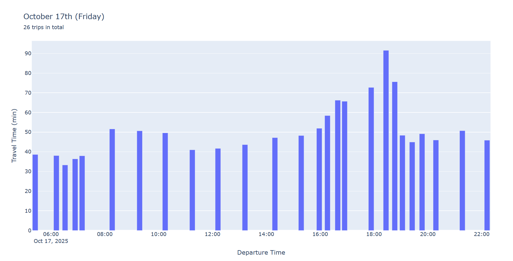
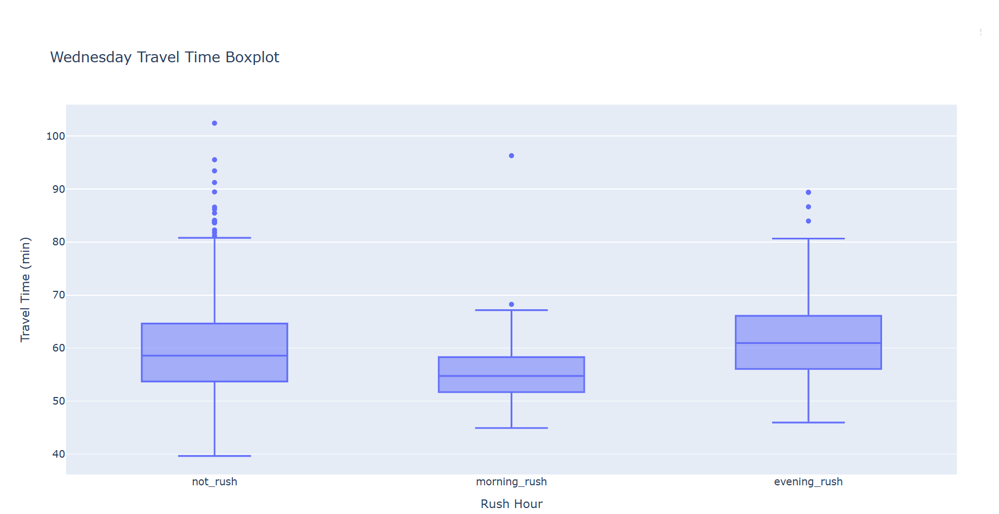
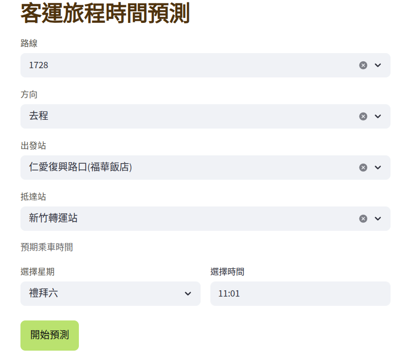
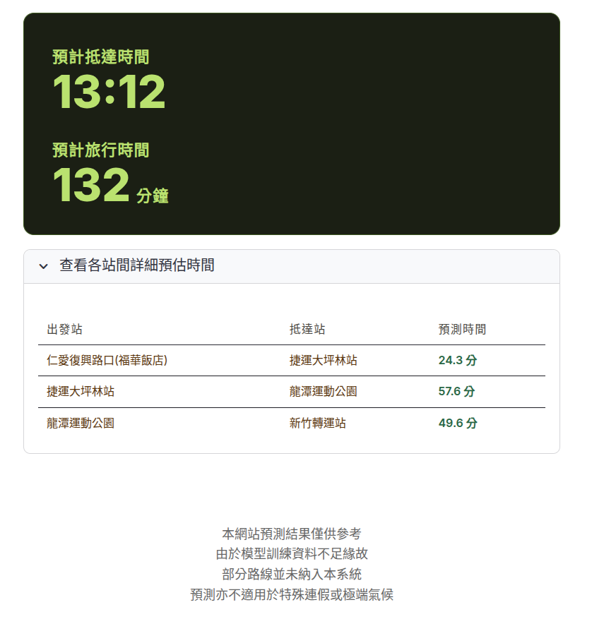

[跳至中文翻譯](#國道客運旅行時間預測)

# Intercity Bus Travel Time Prediction


**[Live Website](https://intercity-bustime-prediction-taiwan.streamlit.app/)**

> **Note:** The app may be asleep due to inactivity. If you see a loading screen, click **"Yes, get this app back up!"** and wait ~10 seconds for it to wake up.


*Solo project · End-to-end ownership from data engineering, modeling, evaluation, and deployment*

Built a deployed machine learning web app that predicts Taiwan intercity bus travel time from large-scale public transportation event data.

---
## Executive Summary
Intercity buses in Taiwan have lost passengers partly because travel time can be difficult to estimate before departure. This project turns raw government bus event records into a deployed prediction tool that lets passengers choose a route, direction, stops, day, and departure time, then returns an estimated travel time and arrival time.

The project showcases the full data-to-product workflow: large-file processing, data quality investigation, feature engineering, model training, custom evaluation, and Streamlit deployment.

---
## Project Highlights
- Built an end-to-end ML pipeline from **60GB+** of raw public transport data to a deployed Streamlit app.
- Processed **200M+** bus event records across **365+ CSV files**, then converted them into optimized Parquet for downstream analysis.
- Scaled from a single-route prototype to **1,644 deployed directional routes** and **6,367 adjacent stop-pair travel-time encodings**.
- Engineered trip-level travel-time labels from raw arrival/departure events using route-aware as-of joins.
- Trained a LightGBM regression model with route/segment target encoding, weekday/weekend handling, and Optuna hyperparameter tuning.
- Built an interactive app that chains segment-level predictions into total journey time and estimated arrival time.

---
## Results

### Deployed System
- Supports **889 public-facing route groups** and **1,644 directional routes**.
- Covers **6,367 adjacent stop-pair segments** for flexible origin/destination prediction within supported routes.
- Returns both total predicted travel time and estimated arrival time.
- Provides optional segment-level breakdowns for multi-stop trips.

### Model Performance
- Improved strict-criterion prediction accuracy from **33% -> 66%** over baseline on route 7500.
- Improved loose-criterion prediction accuracy from **69% -> 90%** over baseline on route 7500.
- Reduced RMSE by **30%** and MAE by **41%** over baseline on route 7500.
- For route 1728, **90%** of predictions were off by no more than **10 minutes** in the single-route prototype.
---
## Data
[Transport Data eXchange (Ministry of Transportation and Communication)](https://tdx.transportdata.tw/)
- **200M+** raw bus event records from Taiwan government open data.
- **365+ CSV files / 60GB+** of raw data, converted into optimized Parquet for analysis and training.
- Event-level records include route IDs, stop IDs, bus plates, stop sequence, direction, event type, and timestamps.
- The raw data contains missing values, inconsistent route/stop records, duplicated names, faulty stop sequences, and route changes that required manual investigation and filtering.

---
## Tech Stack
**Data Engineering** · Polars, LazyFrame, Parquet, PyArrow  
**Analysis** · Pandas, Polars, NumPy, Jupyter  
**Modeling** · LightGBM, Scikit-learn, Optuna  
**Visualization** · Plotly  
**Deployment** · Streamlit, JSON artifacts, cached model loading

---
## System Architecture

1. Ingest raw TDX bus event CSV files.
2. Normalize schema, parse timestamps, clean event records, and write Parquet.
3. Select routes and representative stops with enough usable observations.
4. Generate stop-pair travel-time labels using route-specific as-of join tolerances.
5. Build LightGBM training datasets with route IDs, time features, and mean travel-time encoding.
6. Tune and evaluate the model with separate weekday/weekend validation sets.
7. Deploy the trained model and compact lookup tables through Streamlit.
8. At inference time, chain adjacent stop-pair predictions into total journey time and estimated arrival time.

---
## Technical Challenges

1. **Massive Dataset (60GB+)**
   Streamed hundreds of CSV files into Parquet using Polars lazy execution, avoiding RAM overload and reducing the raw dataset from **60GB+** to about **4.2GB**. Moving the core workflow from Pandas to Polars made repeated joins, filters, and aggregations feasible at full-data scale.

2. **Creating Travel-Time Labels**
   The raw data does not directly provide complete trip durations. I reconstructed travel time by matching departure and arrival events for the same route, bus plate, direction, and stop pair with `pl.join_asof`. Because different routes have different service patterns, I searched route-specific tolerance windows and investigated abnormal matches before creating the final training data.

3. **Route and Stop Quality Control**
   I filtered out routes with insufficient observations, unusable stop-pair matches, source-data inconsistencies, and route-history changes. This included investigating cases where as-of joins required 12-hour tolerances, where only one side of a stop pair was recorded on a given day, and where faulty stop sequences would corrupt travel-time labels.

4. **Segment-Based Prediction**
   The deployed app supports arbitrary origin/destination pairs within a route by predicting each adjacent stop segment sequentially and summing the results. This makes the model reusable across many stop combinations without training a separate model for every possible pair.
---
## Plots and Screenshots

The following results come from EDA on route 1728.
1. Significantly longer travel time due to traffic during rush hours

2. Outliers across every time interval, suggesting naive guessing with mean would lead to low accuracy

3. Finished Streamlit app route selection page

4. Finished Streamlit app prediction result



---
## Modeling Approach

**Model:** LightGBM regression, chosen for fast training on tabular data, strong baseline performance, and efficient handling of route-level categorical structure.

The final deployed model predicts adjacent stop-pair travel time. For a user-selected origin and destination, the app breaks the journey into adjacent stop segments, predicts each segment sequentially, and sums the predictions into total travel time.

**Features**
| Feature | Description |
|---|---|
| Route ID | Captures route-specific behavior across the deployed network |
| Mean travel-time encoding | Historical average for each route/stop-pair segment |
| Minutes from midnight | Captures time-of-day traffic patterns |
| Day of week | Captures weekday/weekend and weekly travel patterns |

*Abandoned features: `is_holiday`, `is_long_holiday` - despite intuitive explanatory power, both degraded model performance during experiments.*

**Evaluation**
- **Standard:** RMSE, R²
- **Custom (passenger-centric):**
  - *Loose (L1):* prediction within 10% of mean route travel time
  - *Strict (L2):* prediction within 5% of mean route travel time
- **Baseline:** always predicting the training set mean/median travel time

**Validation:** Time series split - trained on historical data and tested on later records to avoid leakage from future trips.

**Hyperparameter tuning:** Optuna multi-objective optimization over separate weekday and weekend validation sets. Weekend samples were weighted during training to reduce underfitting caused by weekday/weekend data imbalance.

---

### Single-Route Performance - Bus #7500 (台南轉運站 -> 台北轉運站)

| Metric | Baseline | My Model | Improvement |
|---|---|---|---|
| Loose criterion (±25 min) | 69.10% | **90.22%** | +30.56% |
| Strict criterion (±13 min) | 33.27% | **66.09%** | +98.65% |
| RMSE | 27.53 | **19.03** | −30.88% |
| MAE | 21.50 | **12.56** | −41.58% |
| R² | −0.00 | **0.52** | — |

*2 out of 3 predictions fall within 5% of actual travel time — the threshold at which passengers would consider an estimate reliable.*

*90% of predictions are off by no more than 25 minutes*

### Short-Route Performance - Bus #1728 (新竹轉運站 -> 龍潭運動公園)

| Metric | Baseline | My Model | Improvement |
|---|---|---|---|
| Loose criterion (±5 min) | 51.68% | **74.30%** | +43.71% |
| Strict criterion (±2.5 min) | 26.37% | **43.70%** | +65.72%  |

*90% of predictions are off by no more than 10 minutes*

---

## Streamlit App

The deployed app lets users:
- Search and select a supported route and direction.
- Choose departure and arrival stops from the valid stop sequence.
- Enter expected departure day and time.
- Receive predicted travel time and estimated arrival time.
- Inspect segment-level estimates for multi-stop journeys.

The app loads a serialized LightGBM model plus compact JSON lookup tables for supported routes, stops, and mean travel-time encodings. Streamlit caching keeps model and metadata loading fast during user interaction.

---
## Retraining Pipeline

This repo includes an automated retraining pipeline in `pipeline/` that rebuilds the model and Streamlit support artifacts from raw TDX CSV files. It runs the core workflow end to end: CSV ingestion, cleaning, route/stop selection, as-of join tolerance search, travel-time label construction, LightGBM dataset creation, Optuna tuning, artifact export, and validation.

The pipeline writes versioned outputs under `artifacts/<run-id>/` and does not overwrite `streamlit_app/` directly. Final deployable files are created in:

```text
artifacts/<run-id>/streamlit_artifacts/
```

See [`pipeline/README.md`](pipeline/README.md) for required inputs and run commands.

---
## Repository Structure

- `src/helpers.py` - reusable cleaning, feature engineering, travel-time construction, and data conversion helpers.
- `phase_one_notebooks/` - single-route prototype, initial ETL, EDA, and prediction experiments.
- `phase_two_notebooks/` - route/stop selection, as-of join tolerance search, and final ML dataset preparation.
- `model_training/` - LightGBM training, Optuna tuning, and model evaluation.
- `pipeline/` - automated retraining pipeline for rebuilding model artifacts from raw TDX CSV files.
- `artifacts/` - versioned pipeline outputs, including processed data, model files, reports, and deployable Streamlit artifacts.
- `streamlit_app/` - deployed Streamlit app, model artifact, and JSON lookup tables.
- `plots/` - README figures and app screenshots.

---

# 國道客運旅行時間預測

**[Live 網站](https://intercity-bustime-prediction-taiwan.streamlit.app/)**
> **注意：** 此應用程式可能因閒置而進入休眠狀態。若看到載入畫面，請點擊 **「Yes, get this app back up!」** 並等待約 10 秒鐘讓它重新啟動。

*獨立專案 · 負責從資料工程、建模、評估到部署的 end-to-end 開發*

這是一個已部署的機器學習網站，使用台灣政府開放的客運事件資料，預測國道客運旅程時間。

---
## 執行摘要
國道客運的旅行時間常受路況、時段與路線差異影響，乘客很難在出發前取得可靠的時間估計。本專案將原始政府客運事件資料轉換為可使用的預測系統，讓使用者選擇路線、方向、起訖站、星期與出發時間後，取得預估旅程時間與抵達時間。

此專案展示完整的 data-to-product 工作流程：大檔案處理、資料品質檢查、特徵工程、模型訓練、自訂評估指標，以及 Streamlit 網站部署。

---
## 專案亮點
- 從 **60GB+** 原始公共運輸資料建立 end-to-end ML pipeline，並部署為 Streamlit 網站。
- 處理 **2 億+** 筆客運事件紀錄與 **365+ 個 CSV 檔案**，轉換為最佳化後的 Parquet 供後續分析與訓練使用。
- 從單一路線 prototype 擴展到 **1,644 條已部署方向路線**，並建立 **6,367 組相鄰站點 travel-time encoding**。
- 使用 route-aware as-of join，從原始進站/離站事件中重建 trip-level travel-time labels。
- 使用 LightGBM regression model，結合路線/站點區間 target encoding、weekday/weekend 處理與 Optuna hyperparameter tuning。
- 建立互動式網站，將相鄰站點預測結果串接後加總為完整旅程時間與預估抵達時間。

---
## 專案成果

### 已部署系統
- 支援 **889 組使用者可選路線**與 **1,644 條方向路線**。
- 涵蓋 **6,367 組相鄰站點區間**，可支援同一路線內不同起訖站的旅程時間預測。
- 回傳總預估旅行時間與預估抵達時間。
- 對多站點旅程提供各站點區間的預測明細。

### 模型表現
- 在 7500 路線上，嚴格標準準確率由 baseline 的 **33% 提升至 66%**。
- 在 7500 路線上，寬鬆標準準確率由 baseline 的 **69% 提升至 90%**。
- 在 7500 路線上，相較 baseline，**RMSE 降低 30%**，**MAE 降低 41%**。
- 在單一路線 prototype 中，以 1728 路線為例，**90%** 的預測誤差不超過 **10 分鐘**。

---
## 資料集
[交通部 TDX 運輸資料流通服務平台 (Transport Data eXchange)](https://tdx.transportdata.tw/)
- **2 億+** 筆來自台灣政府開放資料的客運事件紀錄。
- **365+ 個 CSV 檔案 / 60GB+** 原始資料，轉換為最佳化 Parquet 後用於分析與模型訓練。
- 事件資料包含路線 ID、站點 ID、車牌、站序、方向、事件類型與時間戳記。
- 原始資料包含缺失值、路線/站點紀錄不一致、重複站名、錯誤站序與路線變更等問題，需要額外資料品質檢查與過濾。

---
## 技術棧 (Tech Stack)
**Data Engineering** · Polars, LazyFrame, Parquet, PyArrow  
**Analysis** · Pandas, Polars, NumPy, Jupyter  
**Modeling** · LightGBM, Scikit-learn, Optuna  
**Visualization** · Plotly  
**Deployment** · Streamlit, JSON artifacts, cached model loading

---
## 系統架構

1. 匯入 TDX 原始客運事件 CSV 檔案。
2. 統一 schema、解析時間戳記、清理事件紀錄，並寫入 Parquet。
3. 選出有足夠有效觀測值的路線與代表性站點。
4. 使用 route-specific as-of join tolerance 建立站點區間 travel-time labels。
5. 建立 LightGBM 訓練資料，包含路線 ID、時間特徵與平均旅行時間 encoding。
6. 使用分開的 weekday/weekend validation sets 進行模型調參與評估。
7. 將訓練完成的模型與精簡 lookup tables 部署到 Streamlit。
8. 推論時，將相鄰站點區間預測串接加總，得到總旅程時間與預估抵達時間。

---
## 技術挑戰

1. **巨量資料集 (60GB+)**
   使用 Polars lazy execution 將數百個 CSV 檔案轉換為 Parquet，避免記憶體過載，並將原始資料從 **60GB+** 壓縮到約 **4.2GB**。將核心流程從 Pandas 轉向 Polars 後，full-data scale 的 join、filter 與 aggregation 才變得可行。

2. **建立旅行時間標籤**
   原始資料並未直接提供完整 trip duration。我使用 `pl.join_asof`，根據同一路線、車牌、方向與站點區間，配對離站與進站事件以重建旅行時間。由於不同路線的班距與紀錄型態不同，我為各路線/站點區間搜尋合適 tolerance，並在建立最終訓練資料前調查異常配對。

3. **路線與站點品質控管**
   我排除了觀測值不足、站點配對不可用、資料來源不一致或路線歷史已變更的路線。調查內容包含：需要 12 小時 tolerance 才能 join 的異常站點區間、同一天只記錄到起點或終點其中一側的資料問題，以及錯誤站序造成 travel-time label 被污染的案例。

4. **區間式預測**
   部署網站可支援同一路線內任意起訖站選擇。做法是依序預測每一段相鄰站點的旅行時間，再將所有區間加總，因此不需要為每一種起訖站組合個別訓練模型。

---
## 圖表與截圖

以下結果來自 1728 路線的探索性資料分析（EDA）。
1. 尖峰時段因交通壅塞導致旅行時間明顯偏長

2. 每個時間段均存在離群值，顯示單純以平均值猜測會導致準確率偏低

3. 完成版 Streamlit 網站路線選擇頁

4. 完成版 Streamlit 網站預測結果


---
## 建模方法

**Model:** LightGBM regression。選用原因是它在 tabular data 上訓練速度快、baseline performance 穩定，也能有效處理路線層級的類別結構。

最終部署模型預測的是相鄰站點區間的旅行時間。當使用者選擇起點與終點後，網站會將旅程切成多個相鄰站點區間，依序預測每段時間，最後加總成完整旅程時間。

**特徵工程 (Features)**
| Feature | Description |
|---|---|
| Route ID | 捕捉不同路線的行駛模式 |
| Mean travel-time encoding | 每個路線/站點區間的歷史平均旅行時間 |
| Minutes from midnight | 捕捉一天中不同時段的交通模式 |
| Day of week | 捕捉 weekday/weekend 與週間差異 |

*捨棄 features：`is_holiday`、`is_long_holiday` - 雖然直覺上具解釋力，但在實驗中反而降低模型表現。*

**評估指標 (Evaluation)**
- **Standard:** RMSE, R²
- **客製化metrics:**
  - *Loose (L1):* 預測值與該路線平均旅行時間誤差在 10% 以內。
  - *Strict (L2):* 預測值與該路線平均旅行時間誤差在 5% 以內。
- **Baseline:** 一律預測該公車路線的平均旅行時間。

**驗證方式 (Validation):** Time series split，使用較早期資料訓練、較後期資料測試，以避免未來資料洩漏。

**Hyperparameter tuning:** 使用 Optuna 針對 weekday 與 weekend validation sets 進行 multi-objective optimization。由於 weekday/weekend 資料量不平衡，訓練時也提高 weekend samples 權重，以降低 weekend underfitting。

---

### 單一路線表現 - 7500 路線 (台南轉運站 -> 台北轉運站)

| 指標 | 基準模型 | 我的模型 | 改善幅度 |
|---|---|---|---|
| 寬鬆標準 (±25 分鐘) | 69.10% | **90.22%** | +30.56% |
| 嚴格標準 (±13 分鐘) | 33.27% | **66.09%** | +98.65% |
| RMSE | 27.53 | **19.03** | −30.88% |
| MAE | 21.50 | **12.56** | −41.58% |
| R² | −0.00 | **0.52** | — |

*每 3 次預測中就有 2 次誤差在 5% 以內 —— 這是乘客認為預估資訊具備可信度的門檻。*

*90% 的預測誤差不超過 25 分鐘*

### 短途路線表現 - 1728 路線 (新竹轉運站 -> 龍潭運動公園)

| 指標 | 基準模型 | 我的模型 | 改善幅度 |
|---|---|---|---|
| 寬鬆標準 (±5 分鐘) | 51.68% | **74.30%** | +43.71% |
| 嚴格標準 (±2.5 分鐘) | 26.37% | **43.70%** | +65.72% |

*90% 的預測誤差不超過 10 分鐘*

---

## Streamlit 網站

已部署網站可讓使用者：
- 搜尋並選擇支援的路線與方向。
- 從有效站序中選擇出發站與抵達站。
- 輸入預計出發星期與時間。
- 取得預估旅行時間與預估抵達時間。
- 查看多站點旅程中的各區間預測時間。

網站載入序列化後的 LightGBM 模型，以及路線、站點與平均旅行時間 encoding 的精簡 JSON lookup tables。Streamlit caching 則用來加速模型與 metadata 載入。

---
## 重新訓練 Pipeline

此 repo 也包含位於 `pipeline/` 的自動化重新訓練 pipeline，可從 TDX 原始 CSV 檔案重新建立模型與 Streamlit 所需 artifacts。流程涵蓋 CSV 匯入、資料清理、路線/站點選擇、as-of join tolerance 搜尋、旅行時間標籤建立、LightGBM dataset 建立、Optuna 調參、artifact 匯出與驗證。

Pipeline 會將版本化輸出寫入 `artifacts/<run-id>/`，並且不會直接覆蓋 `streamlit_app/`。最終可部署檔案會建立在：

```text
artifacts/<run-id>/streamlit_artifacts/
```

所需輸入與執行指令請見 [`pipeline/README.md`](pipeline/README.md)。

---
## Repository Structure

- `src/helpers.py` - 可重複使用的資料清理、特徵工程、旅行時間建立與資料轉換 helpers。
- `phase_one_notebooks/` - 單一路線 prototype、初始 ETL、EDA 與預測實驗。
- `phase_two_notebooks/` - 路線/站點選擇、as-of join tolerance 搜尋與最終 ML dataset 準備。
- `model_training/` - LightGBM 訓練、Optuna 調參與模型評估。
- `pipeline/` - 從 TDX 原始 CSV 檔案重新建立模型 artifacts 的自動化 retraining pipeline。
- `artifacts/` - pipeline 的版本化輸出，包含處理後資料、模型檔案、報告與可部署的 Streamlit artifacts。
- `streamlit_app/` - 已部署 Streamlit app、模型 artifact 與 JSON lookup tables。
- `plots/` - README 圖表與網站截圖。

